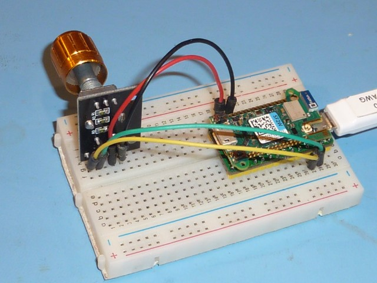
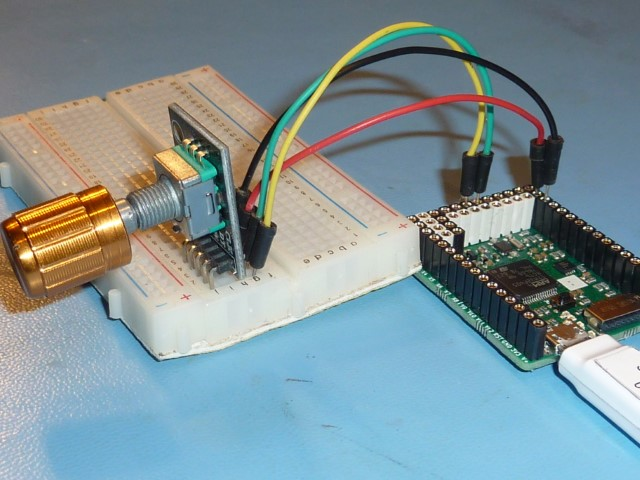
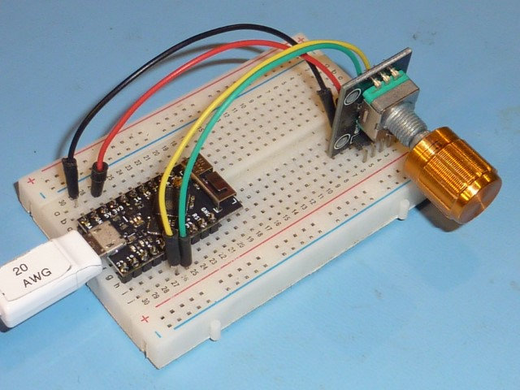

# MicroPython Rotary Encoder Driver
A MicroPython driver to read a rotary encoder.  Works with Pyboard, ESP8266, and ESP32 development boards.  This is a robust implementation providing effective debouncing of encoder contacts.  It uses two GPIO pins configured to trigger interrupts, following Ben Buxton's implementation:
* http://www.buxtronix.net/2011/10/rotary-encoders-done-properly.html
* https://github.com/buxtronix/arduino/tree/master/libraries/Rotary


## Key Implementation Features
#### Interrupt based
Whenever encoder pins DT and CLK change value a hardware interrupt is generated.  This interrupt causes a python-based interrupt service routine (ISR) to run.  The ISR interrupts normal code execution to process state changes in the encoder pins.   

#### Transition state machine
A gray code based transition state table is used to process the DT and CLK changes.  The use of the state table leads to accurate encoder counts and effective switch debouncing.  Credit:  Ben Buxton

## File Installation
Two files are needed to use this module
* platform-independent file `rotary.py` - a core file for all development boards
* platform-specific file:
  * `rotary_irq_esp.py`  Platform-specific code for ESP8266 and ESP32 development boards
  * `rotary_irq_pyb.py`  Platform-specific code for Pyboard development boards

### Copying files to development boards
Copy files to the internal MicroPython filesystem using a utility such as `ampy` or `rshell`
Ampy example below for Pyboards.  Note:  `-d1` option is often needed for ESP8266 boards
```
ampy -pCOMx put rotary.py
ampy -pCOMx put rotary_irq_pyb.py
```

## Class `RotaryIRQ`
### Constructor

```python
   RotaryIRQ(
       pin_num_clk, 
       pin_num_dt, 
       min_val=0, 
       max_val=10, 
       reverse=False, 
       range_mode=RotaryIRQ.RANGE_UNBOUNDED)
```
| argument       | description           | value |
|-------------|-------------|---------|    
| pin_num_clk      | GPIO pin connected to encoder CLK pin| integer |
| pin_num_dt     | GPIO pin connected to encoder DT pin      |  integer |
| min_val | minimum value in the encoder range. Also the starting value |  integer |
| max_val | maximum value in the encoder range (not used when range_mode = RANGE_UNBOUNDED)      | integer |
| reverse | reverse count direction | True or False(default) |
| range_mode | count behavior at min_val and max_val       | RotaryIRQ.RANGE_UNBOUNDED(default) RotaryIRQ.RANGE_WRAP RotaryIRQ.RANGE_BOUNDED |


| range_mode | description |
| ------------- | ------------- |
| RotaryIRQ.RANGE_UNBOUNDED | encoder has no bounds on the counting range |
| RotaryIRQ.RANGE_WRAP | encoder will count up to max_val then wrap to minimum value (similar behaviour for count down) |
| RotaryIRQ.RANGE_BOUNDED |  encoder will count up to max_val then stop.  Count down stops at min_val |              
      
### Methods     
`value()` Return the encoder value
***
`set(value=None, min_val=None, max_val=None, reverse=None, range_mode=None)`
Set encoder value and internal configuration parameters.  See constructor for argument descriptions. `None` indicates no change to the configuration parameter

Examples: 
* `set(min_val=0, max_val=59)` change encoder bounds - useful to set minutes on a clock display
* `set(value=6)`  change encoder value to `6`.  calling `value()` will now return `6`
***
`reset()` set encoder value to `min_val`.  Redundant with the addition of the `set()` method.  Retained for backwards compatibility)
***
`close()` deactivate microcontroller pins used to read encoder     

Note:  None of the arguments are checked for configuration errors.             
    
## Example
* CLK pin attached to GPIO12
* DT pin attached to GPIO13
* GND pin attached to GND
* \+ pin attached to 3.3V
* Range mode = RotaryIRQ.RANGE_WRAP
* Range 0...5

```python
import time
from rotary_irq_esp import RotaryIRQ

r = RotaryIRQ(pin_num_clk=12, 
              pin_num_dt=13, 
              min_val=0, 
              max_val=5, 
              reverse=False, 
              range_mode=RotaryIRQ.RANGE_WRAP)
              
val_old = r.value()
while True:
    val_new = r.value()
    
    if val_old != val_new:
        val_old = val_new
        print('result =', val_new)
        
    time.sleep_ms(50)
```

* For clockwise turning the encoder will count 0,1,2,3,4,5,0,1 ...
* For counter-clockwise turning the encoder will count 0,5,4,3,2,1,0,5,4 ....

### Tested With:
#### Development Boards
* Pyboard D
* PYBv1.1
* TinyPico
* Lolin D32 (ESP32)
* Lolin D32 Pro (ESP32 with 4MB PSRAM)
* Adafruit Feather Huzzah ESP8266
* Adafruit Feather Huzzah ESP32

#### Rotary Encoders
* KY-040 rotary encoder

#### MicroPython versions
* MicroPython v1.12
          

### Rotary Encoder Wiring
| Encoder Pin       | Connection           | 
| ------------- |:-------------:| 
| +      | 3.3V | 
| GND     | Ground      |  
| DT | GPIO pin      |  
| CLK | GPIO pin      | 

### Recommended ESP8266 input pins
This Rotary module requires pins that support interrupts.  The following ESP8266 GPIO pins are recommended for this rotary encoder module
*   GPIO4 
*   GPIO5
*   GPIO12
*   GPIO13
*   GPIO14

The following ESP8266 GPIO pins should be **used with caution**.  There is a risk that the state of the CLK and DT signals can affect the boot sequence.  When possible, use other GPIO pins.
*   GPIO0 - used to detect boot-mode.  Bootloader runs when pin is low during powerup.
*   GPIO2 - used to detect boot-mode.  Attached to pull-up resistor.
*   GPIO15 - used to detect boot-mode.  Attached to pull-down resistor.

One pin does not support interrupts.
*   GPIO16 - does not support interrupts.

### Recommended ESP32 input pins
This Rotary module requires pins that support interrupts.  All ESP32 GPIO pins support interrupts.
 
The following ESP32 GPIO strapping pins should be **used with caution**.  There is a risk that the state of the CLK and DT signals can affect the boot sequence.  When possible, use other GPIO pins.
*   GPIO0 - used to detect boot-mode.  Bootloader runs when pin is low during powerup. Internal pull-up resistor.
*   GPIO2 - used to enter serial bootloader.  Internal pull-down resistor.
*   GPIO4 - technical reference indicates this is a strapping pin, but usage is not described.  Internal pull-down resistor.
*   GPIO5 - used to configure SDIO Slave.  Internal pull-up resistor.
*   GPIO12 - used to select flash voltage.  Internal pull-down resistor.
*   GPIO15 - used to configure silencing of boot messages.  Internal pull-up resistor.

### Oscilloscope Captures
CLK and DT transitions captured on an oscilloscope.  CLK = Yellow. DT = Blue

One clockwise step


One counter-clockwise step


### Board Hall of Fame
Testing with Pyboard D, Pyboard v1.1, and TinyPico development boards




## Acknowlegements
This MicroPython implementation is an adaptation of Ben Buxton's C++ work:  
* https://github.com/buxtronix/arduino/tree/master/libraries/Rotary

Other implementation ideas and techniques taken from:
* https://github.com/SpotlightKid/micropython-stm-lib/tree/master/encoder
* https://www.youtube.com/watch?v=BJHftzjNjkw
* https://github.com/dhylands/python_lcd
        
## Future Ambitions
* uasyncio support
* argument error checking
* add tests